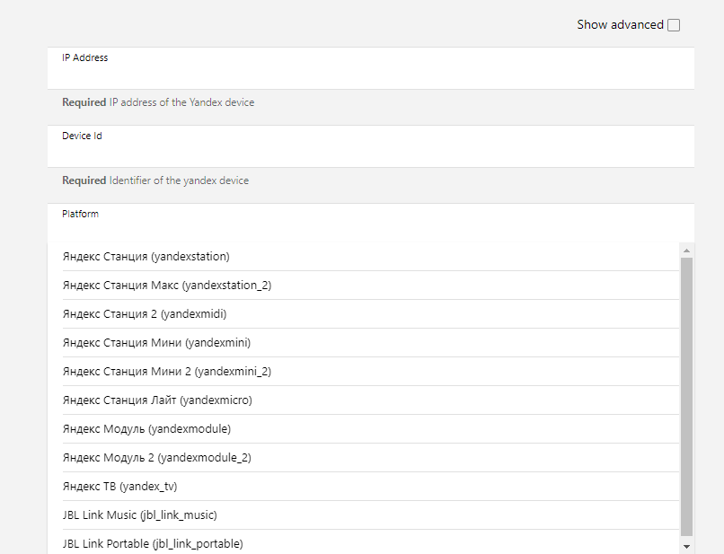
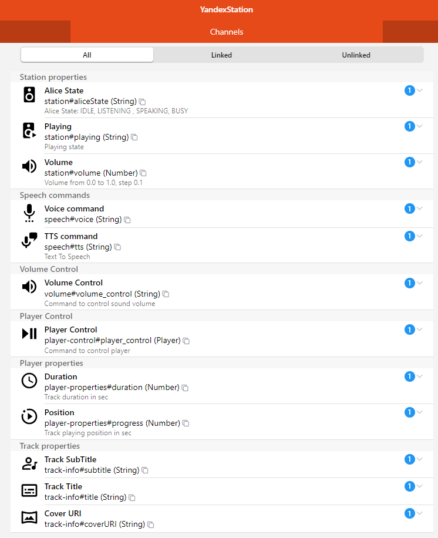
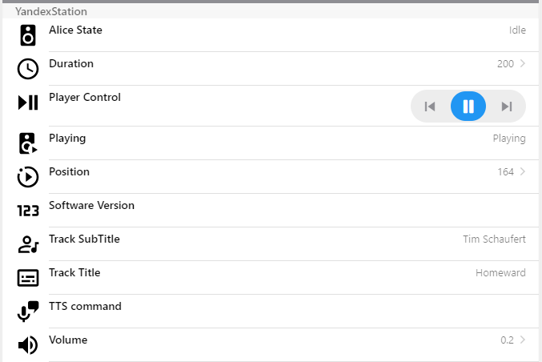

# YandexStation Binding

Binding для локального управления устройствами Яндекс:

- Яндекс Станция
- Яндекс Станция мини
- Яндекс Станция мини 2
- Яндекс Станция лайт
- Яндекс Станци Макс
- Яндекс Модуль
- Яндекс Модуль - 2
- JBL Link Music
- JBL Link Portable

## Discovery

Пока не доступно, но планируется

## Binding Configuration

Для работы биндинга через локальное API требуется знать токен устройства `device_token`.

Токен устройства получается автоматически биндингом.

Для того, чтобы все это заработало, но заполнить следующие поля:

- IP адрес устройства
- Идентификатор устройства (можно взять в приложении Яндекс Умный Дом). Может выглядеть как `LP0000001232134200124`
- выбрать тип устройства из выпадающего списка
- яндекс-токен (oAuth token) (это токен от яндекс музыки)
- 

Как получить яндекс-токен

Вариант1:
- использовать https://music-yandex-bot.ru
- на страничке ввести логин и пароль
- в старых чужих инструкциях информация отличается, на текущий момент, надо жать кнопку Войти, но не переходит в бота, так же появиться кнопка Скопировать токен

## Thing Channels

## Голосовые команды

Нужно создать String item и прилинковать его к каналу `Voice Command`. Затем в этот item надо отправить текст команды, например, `Включи свет`.

Это аналогично тому, чтобы вы сказали Алисе - Включи свет

## Text-to-Speech (синтез речи)

Нужно создать String item и прилинковать его к каналу `TTS Command`. Затем в этот item надо отправить текст, который Алиса произнесе.

Можно отправлять текст даже со служебными командами, чтобы изменить голос, интонацию, ударение.

**Пример1: Наложение эффектов**

https://yandex.ru/dev/dialogs/alice/doc/speech-effects.html

В item надо отправить текст как есть:

`<speaker effect="megaphone">Ехал Грека через реку<speaker effect="-"> видит Грека в реке рак`

**Пример2: Изменение голоса**

https://cloud.yandex.com/en-ru/docs/speechkit/tts/voices

В item надо отправить текст как есть:

`<speaker voice='kostya'>Привет, я - Костя и это мой голос!`

**Пример3: Настройка генерации речи**

https://yandex.ru/dev/dialogs/alice/doc/speech-tuning.html

В item надо отправить текст как есть:

`смелость sil <[500]> город+а берёт`

**Пример4: Говорить шепотом**

В item надо отправить текст как есть:

`<speaker is_whisper="true"'>Я говорю тихо-тихо!"`

**Пример5: Эффекты можно комбинировать**

В item надо отправить текст как есть:

`<speaker voice='kostya' audio='alice-sounds-game-win-1.opus' effect='megaphone'>добро пожаловать`

**А еще можно получить обложку трека**

Channel `coverURI` содержит ссылку

Пример `avatars.yandex.net/get-music-content/2383988/728fabfe.a.9594918-1/%%`

В начало добавить https:// а в конце вместо %% размер обложки, например 600x600

`https://avatars.yandex.net/get-music-content/2383988/728fabfe.a.9594918-1/600x600`
